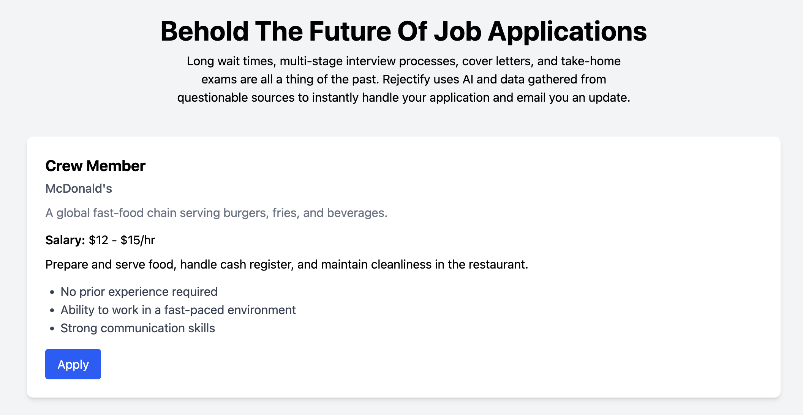
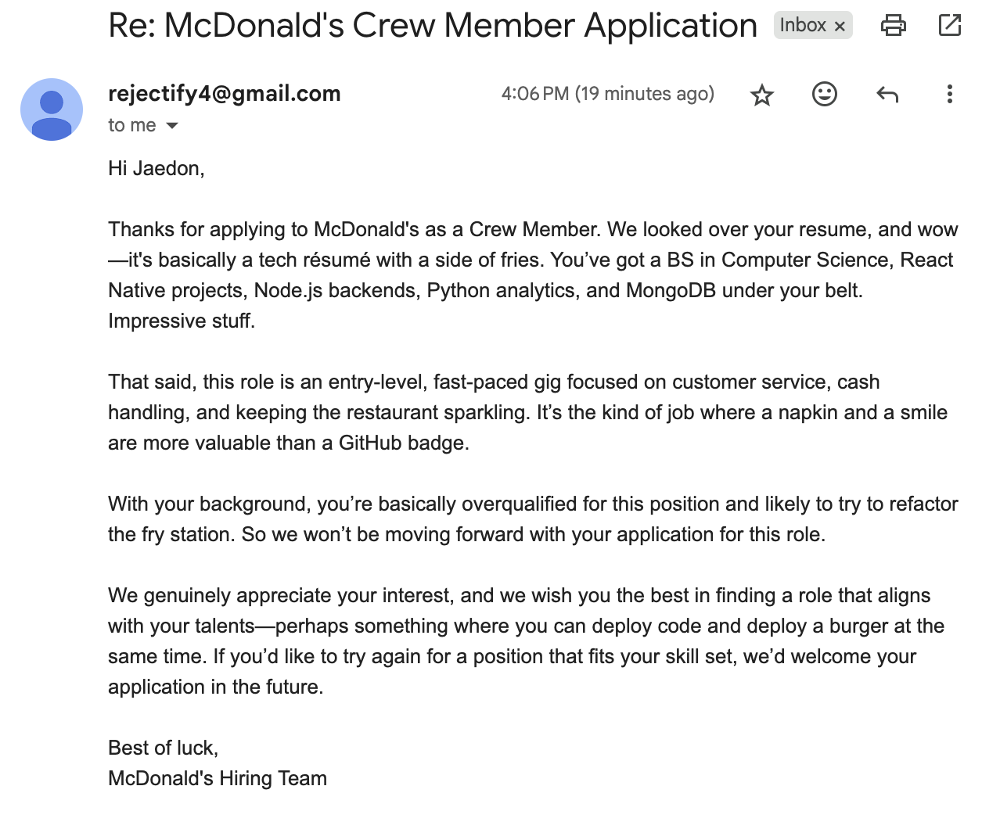

# Rejectify: The Rapid Future Of Job Applications 🚀

Rejectify is a fake job board where every applicant is guaranteed rejection an AI generated rejction email. Each email is personalized based on the applicant’s résumé and the job they applied for. Why wait weeks for a “thanks but no thanks” when you can get one instantly?   

## 🎭 Background
This project was deveolped for the as part of the Comedy Hackathon. Just a way to joke and poke fun at the current U.S. job market.

## 🛠️ Tech Stack
- **Frontend**: React + TailwindCSS  
- **Backend**: Node.js + Express  
- **AI**: OpenAI `gpt-5-nano`  
- **Email**: Nodemailer  

## ⚙️ How It Works
1. User “applies” to a fake job on Rejectify with their resume.  
2. The backend generates a rejection letter with OpenAI.  
3. Nodemailer sends the rejection email straight to the applicant’s inbox.  
4. The result: an instant “we regret to inform you…”  

## Screenshots

